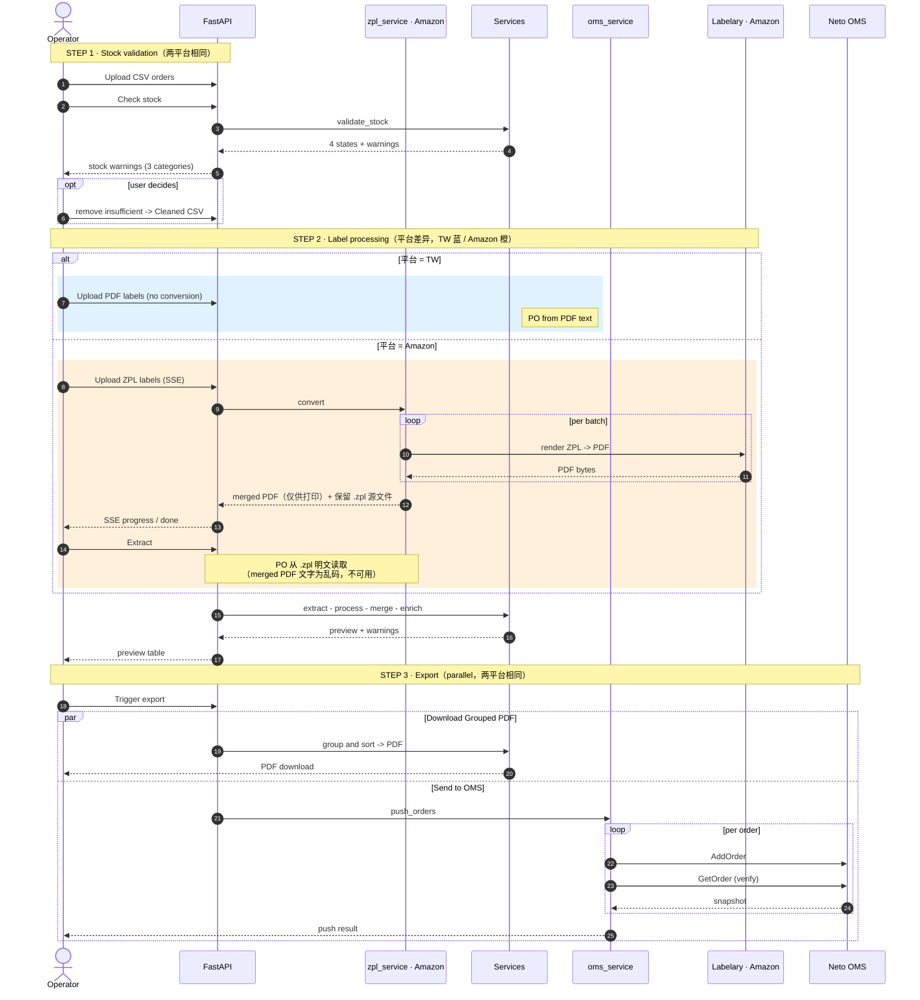

# ShipGuard — Product Requirements Document

## 1. 文档信息

| 项 | 内容 |
|---|---|
| 产品 | ShipGuard — Shipping Label Manager |
| 版本 | v1.2.0 |
| 平台 | Temple & Webster、Amazon |
| 更新 | 2026-06 |

---

## 2. 产品概述

**定位**:面向发货运营的打单工具——校验库存、处理面单、按快递分组出 PDF,并推送订单到 OMS。

**核心价值**:把"订单 → 库存校验 → 面单提取匹配 → 导出/推送"这条履约链路收敛到一个看板,运营一人可完成。

**目标用户**:电商履约/打单运营(单角色,操作者视角)。

**平台差异**:

| 能力 | Temple & Webster | Amazon |
|---|---|---|
| Tab 颜色 | 深绿 #2D5043 | 橙 #FF9900 |
| 标签上传格式 | **PDF** | **ZPL**(必经 ZPL→PDF 转换) |
| PO 来源 | PDF 文本 | ZPL `^FWB` 明文(渲染后 PDF 是乱码) |
| Extract 前置 | CSV 可选 | **CSV 必需** |
| 库存校验 / 预警 | ✅ | ✅ |
| Send to OMS | ✅ | ✅ |
| Download Grouped PDF | ✅ | ✅ |

---

## 3. 产品框架
### 3.1 端到端时序图

实现代码:TW — [upload.py](backend/app/routes/upload.py) · [extract_service_tw.py](backend/app/services/extract_service_tw.py) · [oms_service.py](backend/app/services/oms_service.py);Amazon 另加 [zpl_service.py](backend/app/services/zpl_service.py) · [extract_service_amazon.py](backend/app/services/extract_service_amazon.py)。

> 两平台合一:STEP 1 库存校验、STEP 3 导出**完全相同**,仅 STEP 2 标签处理用 `alt` 分支区分(TW 直传 PDF / Amazon 传 ZPL 经 Labelary 转换),PO 来源也随之不同。



### 3.2 功能清单(P0/P1/P2)

| 模块 | 功能 | 优先级 |
|---|---|---|
| 库存校验 | 上传订单 CSV | P0 |
| 库存校验 | 校验库存(四态判定) | P0 |
| 库存校验 | 设置低库存阈值 | P1 |
| 库存校验 | 移除缺货订单(单/批量) | P1 |
| 库存校验 | 下载 Cleaned CSV | P1 |
| 库存预警 | 三分类视图(③/②/①+ not_found) | P1 |
| 标签处理 | 上传 PDF / ZPL | P0 |
| 标签处理 | 转换 ZPL→PDF(Amazon) | P0 |
| 标签处理 | 提取 & 匹配订单 | P0 |
| 标签处理 | 预览表 | P0 |
| 订单导出 | Send to OMS | P0 |
| 订单导出 | Download Grouped PDF | P0 |
| 平台与配置 | 切换平台(TW/Amazon) | P0 |
| 平台与配置 | 配置快递映射/层级/输出 | P1 |
| 平台与配置 | API 日志面板 | P2 |

> P0 = 履约闭环必备;P1 = 提效;P2 = 辅助。本产品 P0 偏多属正常——核心就是一条不可拆的履约流水线。

---

## 4. 功能需求

### 4.1 库存校验与预警

校验(逐单判断够不够、可删缺货单)和预警(三分类全局视图)共用同一套四态判定，每个 SKU 的库存状态只算一次。

对每个 SKU 跨所有订单聚合：`total_stock`（Neto 可售量；Kit 取组件瓶颈）、`total_need`（需求总和）、`min_need`（单笔最小需求）。

| 状态 | 条件 | 含义 | 运营动作 |
|---|---|---|---|
| **not_found** | Neto 无记录 | SKU 不识别，非库存问题 | 修 SKU/数据 |
| **out** | `total_stock < min_need` | 连最小单都凑不齐 | 补货 |
| **ns** | `min_need ≤ stock < total_need` | 能满足部分单，按 PlaceTime 抢 | 排优先级 |
| **in** | `stock ≥ total_need` | 全部可满足 | 无 |

问题订单可单笔 ✕ 或批量 Remove All Insufficient 移除。

**三分类预警**（四态 roll-up）：
- **③ not_satisfy_all** — 仅含 in + ns
- **② partially_in_stock** — in + out 混合
- **① out_of_stock** — 全 out，或 out + ns
- **not_found** — 数据问题，单独列

低于阈值的 SKU 带 `⚠ LOW` 标记；列名差异见 §6.5。

### 4.2 排序细节

两平台共用同一套算法（`_sort_by_hierarchy` + `group_pdfs`），差异全部由 `config.json` 驱动。

#### 4.2.1 两阶段模型

| 阶段 | 函数 | 作用 |
|---|---|---|
| **A. 行级排序** | `_sort_by_hierarchy` | 对每一行（面单页）定全局先后；用于预览表、Download CSV、拆 PDF 预排 |
| **B. 组间排序** | `group_pdfs` | 按 `group_keys` 聚组，决定组与组的先后，拆成独立 PDF |

组内页序由 A 决定，组的先后由 B 决定，两阶段叠加。

#### 4.2.2 阶段 A 排序键

复合键依次：`_group_order`（组内最大 `_sort_val`）→ `_group`（保证同组聚合）→ `_pin_tier`（置顶0/普通1/置底2）→ `_pin_seq`（pin 数组顺序）→ `_sort_val`（行内值）。

`_sort_val` 取 `sort_order` 中第一个 `Weight` 或 `Postcode`；无则退化为 0。`_group` 排在第 2 位保证同组行不被其他组插队。

#### 4.2.3 阶段 B 组间排序

按 `group_keys`（当前两平台均为 `["Parent_Courier"]`）聚组；`Weight`/`Postcode` 按数值比，其余按字符串；空值排末尾。

#### 4.2.4 两平台配置对照

| 配置项 | TW | Amazon |
|---|---|---|
| `sort_order` | `{Weight: desc}` | `{Parent_Courier: asc, Postcode: asc}` |
| `courier_pin` | `top=[Kiwi]`, `bottom=[NZ Couriers]` | 无 |
| `Weight` 字段 | ✅ 面单提取 | ❌ 无，退化为 Postcode |

> TW = 重量降序 + Kiwi 置顶 / NZ Couriers 置底；Amazon = 快递分组 + 邮编升序。同一份代码，差别只在 config。

---

## 5. 非功能需求

- **外部依赖**:
  - **Labelary** — ZPL → PDF 渲染服务，Amazon 平台必需；无此服务则 Amazon 面单无法处理
  - **Neto / Maropost OMS** — 订单推送目标；通过 `AddOrder` / `GetOrder` API 完成推单与回执
  - **Google Sheets** — OMS 字段映射配置源；`config.json` 中配置 `sheet_id` 后，推单前从指定 Sheet 读取字段映射表，驱动 `neto_lib` 组装订单结构；映射表改动无需发版，改 Sheet 即生效
- **实时反馈**:ZPL 转换走 SSE 流式进度
- **配置驱动**:快递层级、字段映射(`csv_rename / order_mapping / neto_export / state_normalize`)全在 `config.json`,无需改代码
- **会话**:上传文件存于按 session 的临时目录,extract/merge/export 共用

---

## 6. 附录

### 6.1 API 清单

| 端点 | 说明 |
|---|---|
| `POST /api/upload/csv` | 上传订单 CSV |
| `POST /api/upload/pdfs` | 上传 PDF 面单 |
| `POST /api/upload/zpl` | 上传 ZPL(SSE 进度) |
| `POST /api/validate-stock` | 校验库存(`{session_id, platform, threshold}`,按下单日期分配) |
| `GET /api/stock-warning` | 三分类预警(见 §4.2) |
| `POST /api/remove-insufficient` | 移除订单(单/批量) |
| `GET /api/download-cleaned-csv` | 下载 Cleaned CSV |
| `POST /api/extract` | 提取并匹配面单数据 |
| `POST /api/send-to-oms` | 推送 OMS |
| `GET /api/print-pdf` | 生成分组 PDF |

### 6.2 后端结构(库存预警示例)

```
backend/app/
├── services/stock_warning_service.py   # classify_warnings(lines, stock) — 纯函数,可单测
└── routes/dashboard.py                  # GET /api/stock-warning(薄路由,调 service)
```
`classify_warnings` 三步:① group_by_sku 算 `total_stock/total_need/min_need` → 四态(§4.2);② group_by_invoice 抽出 not_found,其余 roll-up;③ 返回 not_found + 三类预警。**改任何库存判断只动 SKU 聚合那一步,各分类自动同步。**

### 6.3 设计参考

- 时序图(§3.1)为内联 mermaid;本文件 `Cmd+K V` 可左改右看,GitHub 上原生渲染。
- 页面截图:`frontend/exports/X6luB.png`(TW)、`frontend/exports/7sSTb.png`(Amazon)
- 库存预警逻辑/UI 草图:`docs/stock_warning_logic.drawio`、`docs/stock_warning_design.drawio`

### 6.4 术语表

| 术语 | 含义 |
|---|---|
| PO# | Purchase Order 单号(= CSV 的 8 位 Order ID) |
| Kit | 组合商品,库存按 `min(组件可用 // 组装数)` 计 |
| Cleaned CSV | 移除缺货订单后、用户确认的订单文件 |
| OMS | Order Management System(Neto/Maropost) |
| ZPL | Zebra 打印指令,Amazon 面单源格式 |

### 6.5 字段映射(Mapping)总览

> 所有映射都在 `config.json`,按 `tw` / `amazon` / `shared` / `oms` 分层。**改映射不改代码**;TW 与 Amazon 逻辑一致,只是映射表不同。

**A. CSV 列识别(库存校验入口)** — 见 §4.2(SKU / 数量 / PO 列)。

**B. CSV 改名 `merge.csv_rename`**(入系统时统一列名)

| 平台 | 规则 |
|---|---|
| TW | 无(列名已是 `PO #`) |
| Amazon | `Order ID` → `PO #` |

**C. 收件信息 `merge`**(State / Postcode 来源)

| 项 | TW | Amazon |
|---|---|---|
| merge_key | `PO #` | `PO #` |
| State | PDF 提取 | CSV `Ship To State` |
| Postcode | PDF 提取 | CSV `Ship To ZIP Code` |
| `state_normalize` | — | 州全称→缩写:New South Wales→NSW / Victoria→VIC / Queensland→QLD / South Australia→SA / Western Australia→WA / Tasmania→TAS / Australian Capital Territory→ACT / Northern Territory→NT |

**D. OMS 订单字段映射 `order_mapping`**(内部列 → Neto Order 字段)

| TW:内部列 → Neto | Amazon:内部列 → Neto |
|---|---|
| `PO #`→OrderID · `Ship First Name`→ShipFirstName · `Ship Last Name`→ShipLastName · `Ship Street 1/2`→ShipStreet1/2 · `Ship City`→ShipCity · `Ship State`→ShipState · `Ship Post Code`→ShipPostCode · `Ship Country`→ShipCountry · `Ship Phone`→ShipContactPhone · `Courier`→ShippingMethod | `PO #`→PurchaseOrderNumber · `Ship Method`→ShipStreet1 · `Order Place Date`→DatePlaced · `Required Ship Date`→DateRequired |

**E. 订单行映射 `order_line_mapping`**

| TW | Amazon |
|---|---|
| `SKU`→SKU · `Quantity`→Quantity · `Weight`→ShippingWeight · `Unit Price`→UnitPrice | `SKU`→SKU · `Item Quantity`→Quantity |

**F. Amazon 专属导出 `neto_export`**(TW 无此段)

- `copy_columns`:`PO #` → `Order ID`(复制保留)
- `static_columns`:`Username=AmazonAU_DF` · `Sales Channel=Amazon Vendor` · `Order Status=New` · `Payment Method=Amazon AU`
- `drop_columns`:`PDF File Name` · `Label_Qty` · `Single/Multi_Ctn` · `Parent_Courier` · `Logo_Text`
- `oms_preview`:预览/推送用的 `order_mapping` + `order_line_mapping` + `order_defaults`(地址兜底 ShipState=VIC / ShipPostCode=3000 / ShipCity=Melbourne / ShipPhone=0400000000)+ 列定位(`postcode_col=Ship To ZIP Code` · `state_col=Ship To State` · `po_col=PO #` · `price_col=Item Cost`)

**G. 快递映射与发票号**

| 项 | TW | Amazon |
|---|---|---|
| `courier_map`(原始名→标准名) | 9 条(Kiwi / NZ Couriers / Allied / Toll / Couriers Please / Aus Post / Hunter / Direct Freight / Mainfreight) | 6 条(Dragonfly / CODE Express / Australia Post / Parcel Point / Couriers Please …),`default_courier=Amazon` |
| `courier_hierarchy`(标准名→{code, children}) | Allied(RY,含 Kiwi/NZ Couriers)/ Toll(TL)/ Couriers Please(CP)/ Aus Post(AP)/ Hunter(HT)/ Direct Freight(DF)/ Mainfreight(MF) | Amazon(AM,含子)/ Couriers Please(CP) |
| 发票号 | 前缀 `WF`,模板 `{prefix}{courier_code}{S/M}{PO}`,code 取 **parent** 级 | 前缀 `DF` |
| 排序 / pin | `Weight` 降序;pin top=Kiwi / bottom=NZ Couriers | `Parent_Courier`+`Postcode` 升序 |

**H. OMS 连接 `oms`(共享)**:`endpoint` · `username` · `api_key` · `order_defaults` · `user_groups`(两平台同一 Neto 账号)。

> 一句话:**字段差异全部收敛在 `config.json` 的映射表里;TW / Amazon 跑同一套代码,各读各的映射。**
